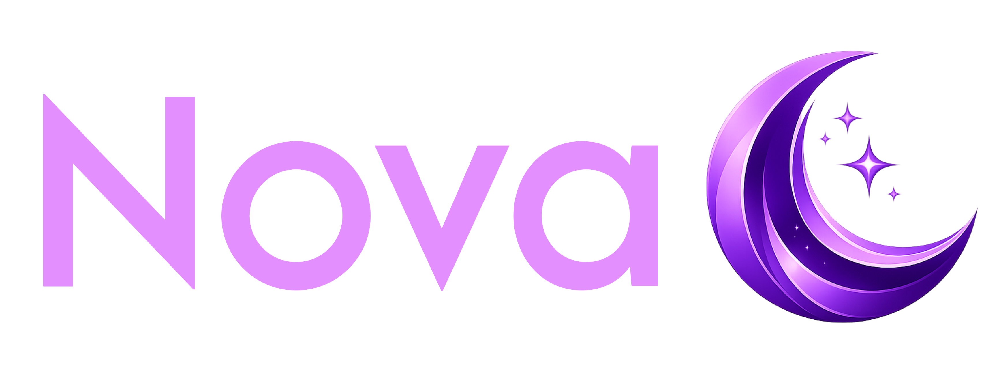

# Hi, I'm Cristian Jiménez 👋
# Hola! soy Cristian Jiménez 👋
<!--

Here are some ideas to get you started:

- 🔭 I’m currently working on ...
- 🌱 I’m currently learning ...
- 👯 I’m looking to collaborate on ...
- 🤔 I’m looking for help with ...
- 💬 Ask me about ...
- 📫 How to reach me: ...
- 😄 Pronouns: ...
- ⚡ Fun fact: ...
-->

## 🔨 Skills:

## Interest in learning  |  Interés en aprender:

## Marca personal

Desde siempre he sido fan de la astronomía y todo lo relacionado al espacio,
            Nova nace de la idea de querer combinar la palabra nova que significa 'nueva' en latín
            pero que actualmente se usa para describir un evento astronómico en el que una estrella
            aumenta su brillo de forma muy rápida, dando la impresión que ha nacido una 'nueva estrella',
            y la luna que es nuestro satélite natural de la tierra,
            por lo que decidí combinar ambos conceptos y así surgió Nova
            y que poco a poco se ha convertido en una especie de marca personal para mí.

## Personal brand

I have always been a fan of astronomy and everything related to space. 'Nova' was born from the idea of wanting to combine the word 'nova', which means 'new' in Latin but is currently used to describe an astronomical event where a star rapidly increases its brightness, giving the impression that a 'new star' has been born, and the moon, which is our natural satellite of the Earth. Therefore, I decided to combine both concepts, and thus 'Nova' emerged, which has gradually become a sort of personal brand for me.

